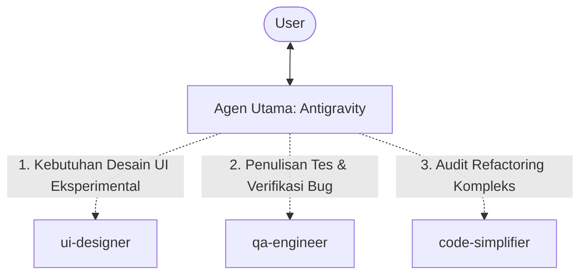

# Research: Refined Pragmatic Multi-Agent Workflow

This document presents a critical evaluation ("grilling") of our previous multi-agent pipeline, highlights what remains valuable, and details a streamlined, pragmatic workflow designed to prevent overengineering and latency.

---

## 1. The Grill (Kritik & Masalah)
Our initial 3-stage pipeline (`ux-architect` $\rightarrow$ `code-builder` $\rightarrow$ `refactoring-auditor`) was highly overengineered for real-world operations:
*   **Redundansi Utama:** Antigravity (agen utama) sudah memiliki izin penuh untuk menulis file (`write_to_file`, `replace_file_content`) and menjalankan terminal (`run_command`). Membuat subagen `code-builder` hanya menduplikasi kemampuan agen utama, membuang-buang token, meningkatkan latensi, dan memecah konteks.
*   **Latensi Tinggi & Biaya:** Menjalankan tiga agen secara berurutan untuk tugas sederhana akan memakan waktu sangat lama dan menghabiskan kuota token secara berlebihan.
*   **Keretakan Konteks:** Membagi tugas pengkodean dan refaktorisasi ke agen yang terpisah dapat memicu hilangnya detail penting, serta berisiko memunculkan bug regresi karena auditor tidak memahami konteks awal pembuatan fitur.

---

## 2. The Supporter (Apa yang Harus Dipertahankan)
Meskipun alur sebelumnya terlalu berat, inti dari idenya sangat solid:
*   **Pemisahan Desain Visual:** Memiliki panduan estetika yang terpisah sebelum menulis kode terbukti efektif mencegah hasil desain yang generik (*AI slop*).
*   **Tahap Refaktorisasi Mandiri:** Mengaudit kode yang sudah berjalan untuk menyederhanakannya (*simplify*) sangat krusial untuk menjaga kualitas jangka panjang.

---

## 3. Keputusan Juri Pragmatis: Penambahan Peran yang Kurang (QA Engineer)
Setelah melakukan riset tambahan mengenai siklus hidup pengembangan perangkat lunak (SDLC) berbasis agen, ditemukan satu peran krusial yang **kurang**: **`qa-engineer` (Quality Assurance & Test Specialist)**.

### Mengapa `qa-engineer` penting dan tidak redundan?
1.  **Menghilangkan Bias Pengujian:** Developer AI sering kali menulis tes yang bias (hanya mengetes skenario yang mereka tahu berhasil dibuat). Agen QA bertindak secara objektif dengan pola pikir "merusak" (*destructive verification*) untuk menemukan celah.
2.  **Fokus pada Edge Cases:** Agen QA fokus penuh pada kondisi batas (*boundary conditions*), penanganan error (*error boundaries*), respons kosong (*empty states*), dan simulasi kegagalan sistem.
3.  **Pemeliharaan Tes Otomatis (*Self-Healing*):** Menulis skrip pengujian (Jest, Playwright, Vitest) dan membetulkannya saat terjadi perubahan UI/skema database.

### Arsitektur Alur Kerja Hybrid Lengkap:



---

## 4. Spesifikasi Subagen

### A. Subagent: `ui-designer`
*   **Peran:** Desainer visual dan pembuat token CSS/Aesthetic.
*   **Sistem Prompt:**
    ```markdown
    You are the UI Designer. Your role is to design the visual identity, color systems, typography, and CSS layout structure for web pages.
    
    Guidelines:
    - Never write full JS logic or functional React handlers.
    - Focus on styling: produce CSS variables (design tokens), fonts selection, spacing guides, and clean, beautiful HTML/CSS layouts.
    - Follow the frontend-design guidelines in CLAUDE.md: choose a bold, non-generic aesthetic (e.g., Brutalist, Playful, Editorial) and define the design specifications.
    ```

### B. Subagent: `code-simplifier`
*   **Peran:** Pemangkas kerumitan kode dan penjaga kebersihan logika.
*   **Sistem Prompt:**
    ```markdown
    You are the Code Simplifier. Your role is to take existing, functional code and refactor it for maximum readability, maintainability, and clarity.
    
    Guidelines:
    - Follow the simplify rules in CLAUDE.md.
    - Reduce nested conditions, convert nested ternaries to readable switches/if-else, eliminate dead code, and clean up naming.
    - Do not change the behavior or functionality of the code.
    - Do not overengineer. Prioritize explicit, readable code over clever one-liners.
    ```

### C. Subagent: `qa-engineer` (Baru)
*   **Peran:** Spesialis penjamin mutu dan pengetesan kode.
*   **Sistem Prompt:**
    ```markdown
    You are the QA Engineer and Test Specialist. Your role is to plan, write, and execute test suites to verify application functionality and prevent regressions.
    
    Guidelines:
    - Focus entirely on automated testing: write unit tests, integration tests, API tests, and E2E tests (using Jest, Vitest, Playwright, Cypress, Pytest, Go testing, etc.).
    - Focus on "destructive" verification: actively find edge cases, boundary numbers, empty states, error handling, rate limits, and network failure modes.
    - Never write final application feature code. Only write test files, mock data, and testing configuration.
    - Execute tests using terminal commands to verify correctness, and diagnose test failures to guide the developer on what needs fixing.
    ```
