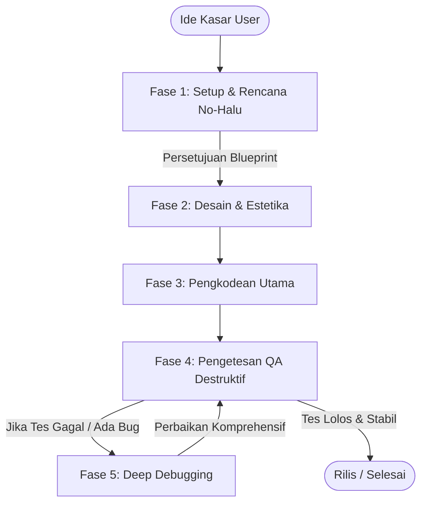

# SOTA Pragmatic Agentic SDLC (PA-SDLC) Workflow

Dokumen ini mendefinisikan alur kerja pengembangan perangkat lunak pragmatis tingkat lanjut (State-of-the-Art) untuk memastikan agen AI bekerja secara terstruktur, aman dari halusinasi, menggunakan dependensi terbaru (tidak deprecated), dan bebas dari bug regresi ("tambal sulam").

---

## 🌀 Alur Kerja Utama (5-Fase Siklus Hidup)

---

## 🛠️ Detail Fase dan Instruksi Kerja

### 📋 Fase 1: Setup, Riset, & Rencana No-Halu
Tujuan dari fase ini adalah menyelaraskan ide kasar Anda menjadi cetak biru teknis yang aman, tanpa meminta kredensial berulang kali.

1.  **Challenge Asumsi Awal (XY Problem):**
    *   Jangan membebek atau langsung mengincar gol yang diminta jika cara yang diusulkan oleh user didasarkan pada asumsi yang keliru, sub-optimal, atau tidak aman.
    *   Evaluasi hal-hal mendasar terlebih dahulu. Diskusikan dan luruskan asumsi dasarnya sebelum mulai membangun.
2.  **Riset Dependensi & Version Safety:**
    *   AI **wajib melakukan pencarian web** untuk memeriksa pustaka/framework yang akan digunakan. Periksa versi terbaru, dokumentasi API terkini, dan pastikan tidak ada pustaka *deprecated* (ketinggalan zaman) yang diinstal.
    *   Jangan berasumsi dataset bawaan LLM selalu benar.
3.  **Audit Kebutuhan Kredensial & Lingkungan:**
    *   AI harus mengidentifikasi dan mencantumkan dengan jelas semua kredensial, API keys, basis data, dan konfigurasi lingkungan yang diperlukan.
    *   **Tanyakan langsung ke user** di awal sesi jika ada data yang kurang.
4.  **Pembuatan Berkas Cetak Biru (`setup_blueprint.md`):**
    *   Buat berkas rencana kerja yang berisi: arsitektur sistem, struktur folder, daftar pustaka dan versinya, serta instruksi penyiapan `.env`.
    *   Gunakan variabel lingkungan (seperti `process.env.API_KEY`) di dalam kode—**jangan pernah menulis kredensial mentah (hardcoded)**.

---

### 🎨 Fase 2: Desain Spesifikasi & Estetika (`ui-designer`)
1.  **Pilih Tema Estetika yang Berani:** Sesuai panduan `frontend-design` di [CLAUDE.md](file:///home/ayintaput/CLAUDE.md), pilih satu tema visual ekstrem (misal: *Neo-Brutalist*, *Playful*, *Industrial*, *Cyberpunk*).
2.  **Pembuatan Token & Layout:** Delegasikan pembuatan CSS variables, skema warna, dan wireframe dasar ke subagen `ui-designer`.

---

### 💻 Fase 3: Pengkodean Utama (Antigravity)
1.  **Implementasi Modular:** Antigravity menulis kode berdasarkan spesifikasi dari Fase 2.
2.  **Simplifikasi Real-time:** Terapkan pemangkasan kode redundan secara langsung selama penulisan agar kode tidak menumpuk rumit di akhir.

---

### 🧪 Fase 4: Pengetesan QA Destruktif (`qa-engineer`)
1.  **Delegasikan Pengetesan:** Panggil subagen `qa-engineer` untuk membuat skrip pengujian (Jest, Vitest, Playwright, Cypress).
2.  **Fokus Skenario Ekstrem:** Pengujian harus mencakup:
    *   Kasus sukses (*happy paths*).
    *   Kondisi batas (*edge cases* seperti input kosong, angka terlalu besar, format salah).
    *   Penanganan error (*error boundaries* dan kegagalan jaringan).
3.  **Eksekusi & Diagnosis:** Jalankan tes di terminal. Jika gagal, catat log kesalahan secara detail untuk dianalisis di Fase 5.

---

### 🕵️ Fase 5: Deep Debugging & Anti-Tambal-Sulam
Kebanyakan kegagalan AI terjadi karena perbaikan bug yang terburu-buru, yang justru merusak bagian kode lain. Kita menerapkan kebijakan **"Stop & Think"**:

| Langkah | Aktivitas | Deskripsi |
| :--- | :--- | :--- |
| **1. Lacak Kaskade** | Analisis Dampak | Cari tahu bagian mana saja yang terhubung dengan modul yang rusak. Jangan langsung mengedit kode. |
| **2. Temukan Root Cause** | Analisis Akar Masalah | Telusuri tumpukan kesalahan (stack trace) dan log untuk mencari alasan logis mengapa bug terjadi. |
| **3. Desain Solusi** | Solusi Struktural | Rancang perbaikan yang membenahi arsitektur dasarnya, bukan sekadar menambal nilai return atau parameter secara ad-hoc. |
| **4. Verifikasi Regresi** | Re-run Test Suite | Setelah diperbaiki, jalankan **seluruh** suite pengujian untuk memastikan tidak ada fitur lain yang rusak akibat perbaikan tersebut. |

---

## 📜 Cara Menjalankan Alur Kerja Ini secara Pragmatis
*   **Jangan Membabi Buta Mengikuti Kata User:** Jika ide dari user berpotensi merusak keamanan atau menggunakan metode yang sudah usang (*deprecated*), AI wajib memberikan masukan solutif yang lebih modern secara sopan dan informatif.
*   **Gunakan Berkas Sebagai Memory Cache:** Simpan semua konfigurasi dan keputusan penting di berkas cetak biru agar AI tidak kehilangan arah di tengah jalan.
*   **Pembaruan Status Sesi (Session Anchoring):** Di akhir setiap tugas atau modifikasi file, tuliskan catatan ringkas di [session_state.md](file:///home/ayintaput/session_state.md). Ini menghemat ribuan token karena AI tidak perlu melakukan pemindaian codebase secara berulang-ulang untuk mengingat status pengerjaan terakhir.
